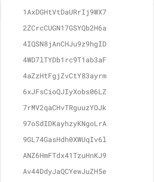

# Mini-paint

### [Technical task](https://docs.google.com/document/d/1feIA0eu0NkR4J2mCdCc8oPErbET--IlqAEoSpRo1KHA/edit)

## Available Scripts

In the project directory, you can run:

### `npm start`

Runs the app in the development mode.\
Open [http://localhost:3000](http://localhost:3000) to view it in the browser.

The page will reload if you make edits.\
You will also see any lint errors in the console.

### `npm test`

Launches the test runner in the interactive watch mode.\
See the section about [running tests](https://facebook.github.io/create-react-app/docs/running-tests) for more
information.

### `npm run build`

Builds the app for production to the `build` folder.\
It correctly bundles React in production mode and optimizes the build for the best performance.

The build is minified and the filenames include the hashes.\
Your app is ready to be deployed!

See the section about [deployment](https://facebook.github.io/create-react-app/docs/deployment) for more information.

### `npm run eject`

**Note: this is a one-way operation. Once you `eject`, you can’t go back!**

If you aren’t satisfied with the build tool and configuration choices, you can `eject` at any time. This command will
remove the single build dependency from your project.

Instead, it will copy all the configuration files and the transitive dependencies (webpack, Babel, ESLint, etc) right
into your project so you have full control over them. All of the commands except `eject` will still work, but they will
point to the copied scripts so you can tweak them. At this point you’re on your own.

You don’t have to ever use `eject`. The curated feature set is suitable for small and middle deployments, and you
shouldn’t feel obligated to use this feature. However we understand that this tool wouldn’t be useful if you couldn’t
customize it when you are ready for it.

### `npm run lint`

This command will start ESLint script for `./src` directory

## Project architecture

The project includes these directories: `./src`, `./public`.

In `./src` you can find such folders:

`/assets` - folder that contains `mixins.sass` and main style `styles.sass`

`/core` - there are all the logic of the project. Redux, Redux-Saga etc. are located here

`/pages` - there are React FC's of each page/route of the project

### Folders in `./src/core`:

`/actions` - there are all the actions of the app

`/components` - there are two FC's - Loader and PrivateWrapper

`/configs` - there is a firebase config

`/reducers` - folder that contains all the reducers of the app

`/sagas` - Redux-Saga files for this app

`/service` - files that contains function working with Firebase

`/store` - Redux store of the app

### Folders in `./src/pages`

`/HomePage` - there is a `HomePage` component and a `.sass` file for the component

`/NewPage` - there is a `NewPage` component, also `types.ts` for the component and a folder `/components` that
contains `Canvas.tsx` and `types.ts` for it

`/SignPage` - there is a `SignPage` component and a `.sass` file for it

## How to run the app

1. Clone this repository to your computer
2. Open your terminal/cmd and execute this command: `npm i`
3. Then execute this: `npm start`
4. You're done!

## Database snapshot

### Collection -> Document -> Fields

We have a `Collection` with name `images`, that contains each user's images.

Example:

Each the document contains these fields:

* createdAt: `number`
* data: `string`
* user: `string`

`createdAt` - time in seconds that got using `Timestamp().now.seconds`

`data` - this is exactly user's drawing. Got using `.toDataURL`

`user` - user's nickname. Got with `.currentUser.displayName`

## Application stack

#### Main technology: `React v18.1.0`

Technology for app typing: `Typescript v4.6.4`

Technology for routing: `React-Router-DOM v6.3.0`

Technology for data manage: `Redux v4.2.0`

Technology for app styling: `SASS v1.51.0`

Technology for user auth and data storage: `Firebase v9.8.1`

### Helping technologies:

For Redux async/await actions working with Firebase: `Redux-Saga v1.1.3`

For actions types: `typesafe-actions v5.1.0`

For sliders: `Swiper v8.2.3`

For UI: `MUI v5.6.2`

For icons: `FontAwesome v6.1.1`